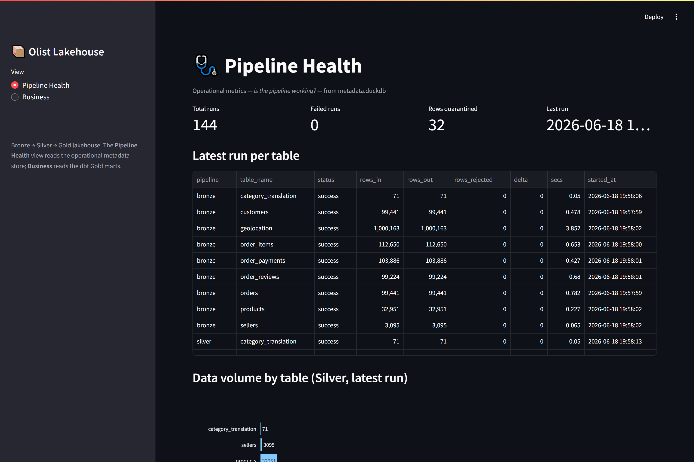
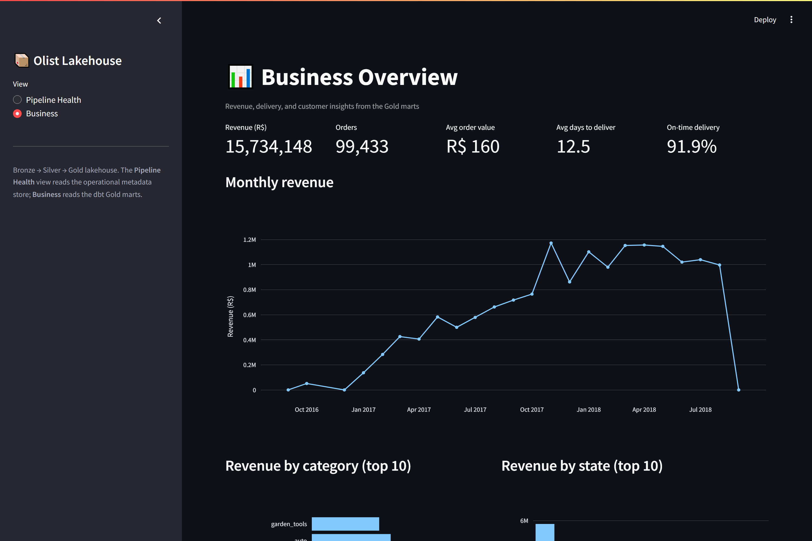

# 📦 Olist E-Commerce Data Lakehouse


A production-thinking **Bronze → Silver → Gold data lakehouse** built on the real
[Olist Brazilian e-commerce dataset](https://www.kaggle.com/datasets/olistbr/brazilian-ecommerce)
— ~100K orders of messy, multi-table data. It runs entirely on a laptop but is
architected like a cloud pipeline, so the *engineering* transfers even though the
infrastructure doesn't.

> **Why this project exists:** most portfolio data projects load a clean CSV and
> draw a chart. This one assumes **data is wrong, late, and duplicated** — and
> shows the engineering you do about it: bad rows quarantined with reasons,
> idempotent re-runs, tested transformations, and a pipeline that watches its
> own health.

**Status:** all five phases implemented and verified end-to-end on the full
dataset — ingestion, cleaning, dbt Gold marts, observability, and a dashboard.

---

## Architecture

A classic **medallion (Bronze → Silver → Gold)** lakehouse. Each layer has one
job and trusts the layer below it less than you'd think.

```
                        ┌──────────────────────────────────────────────┐
                        │                 Kaggle                        │
                        │      olistbr/brazilian-ecommerce (9 CSVs)     │
                        └───────────────────────┬──────────────────────┘
                                                │  src/download_data.py
                                                ▼
        ┌──────────────┐   read as strings   ┌──────────────────────────────┐
        │  data/raw/   │ ──────────────────► │  BRONZE  (Delta, partitioned │
        │  *.csv       │  + audit columns    │  by _ingest_date)            │
        └──────────────┘                     │  raw, immutable landing zone │
                                             └───────────────┬──────────────┘
                                                             │ src/transform/silver.py
                            cast · validate · dedup · reject │
                                                             ▼
   ┌───────────────────────────┐               ┌──────────────────────────────┐
   │ data/_rejected/silver/    │ ◄──quarantine─│  SILVER  (Delta, typed,      │
   │  <table>/rejected.parquet │  with reason  │  cleaned, deduplicated)      │
   │  (rows that failed checks)│               │  trustworthy for analysis    │
   └───────────────────────────┘               └───────────────┬──────────────┘
                                            src/publish/ -> DuckDB │
                                                             ▼
                                             ┌──────────────────────────────┐
                                             │  GOLD  (dbt models in DuckDB) │
                                             │  dims + facts + 6 marts:      │
                                             │  monthly revenue · RFM ·      │
                                             │  seller perf · delivery perf  │
                                             │  + 51 tests, generated docs   │
                                             └───────────────┬──────────────┘
                                                             │ app/streamlit_app.py
                                                             ▼
                                             ┌──────────────────────────────┐
                                             │  STREAMLIT dashboard          │
                                             │  Business view + Health view  │
                                             └──────────────────────────────┘

  ┌───────────────────────────────────────────────────────────────────────────┐
  │  OBSERVABILITY (built from day one):  warehouse/metadata.duckdb            │
  │    pipeline_runs   — one row per run: rows in/out/rejected, delta, status  │
  │    column_metrics  — per-run null rate for every column                    │
  └───────────────────────────────────────────────────────────────────────────┘
```

### Stack

| Purpose          | Tool                     | One-line why |
|------------------|--------------------------|--------------|
| Storage format   | Parquet + **Delta Lake** | ACID writes, time travel, idempotent overwrites — a real lakehouse format, no JVM needed (`delta-rs`). |
| Processing       | **DuckDB** + **pandas**  | Fast, SQL-native, zero cluster to run locally. |
| Transformations  | **dbt** (dbt-duckdb)     | Industry standard; tests + docs are first-class. |
| Orchestration    | **Prefect** *(isolated env)* | Pythonic flows with retries/UI. Runs in its own venv — see note below. |
| Observability    | Custom DuckDB tables     | Built and owned here — `pipeline_runs`, `column_metrics`. |
| Dashboard        | **Streamlit** + Plotly   | Python-native; business view + pipeline-health view. |

---

## Results (full Olist dataset)

Run end-to-end on the real ~100K-order dataset (Bronze → Silver → publish → dbt),
every number below is produced by the pipeline and verified by its tests.

| Metric | Value |
|--------|-------|
| Orders processed | **99,441** |
| Revenue | **R$ 15.7M** |
| Avg. order value | **R$ 160** |
| Avg. days to deliver | **12.5** |
| On-time delivery rate | **91.9%** |
| Unique customers | **94,982** (3% repeat-purchase rate) |
| Geolocation rows ingested | **1,000,163** |
| Rows quarantined (real data) | **8** — delivered orders with no delivery date, caught by the semantic business-rule layer |
| dbt models / tests | **19 models / 51 tests**, all passing |

The headline numbers match published Olist analyses (≈R$15.9M GMV, ≈12 days,
≈92% on-time), which is the cross-check that the joins and aggregations are correct.

**A few findings the dashboard surfaces:** credit cards drive **78%** of payment
value (boleto 18%); reviews skew positive (**58% are 5-star**, avg **4.09/5**);
and the customer base is overwhelmingly **one-time buyers** (3% repeat) — a
retention story hiding under healthy top-line revenue.

## Dashboard

Two views, two audiences — a **Business** view over the Gold marts and a
**Pipeline Health** view over the operational metadata store.

| Pipeline Health | Business Overview |
|-----------------|-------------------|
|  |  |

---

## Quickstart

```bash
# 1. Create + activate the virtual environment (Windows PowerShell)
python -m venv .venv
.venv\Scripts\Activate.ps1

# 2. Install dependencies
pip install -r requirements.txt

# 3a. Try it immediately with synthetic data (no Kaggle needed).
#     Plants deliberately broken rows so the quarantine + orphan logic fire.
python -m scripts.make_sample
python -m scripts.run_pipeline all       # bronze -> silver -> publish -> dbt

# 3b. ...OR use the real dataset (needs Kaggle credentials — see below)
python -m scripts.run_pipeline download
python -m scripts.run_pipeline all

# 4. Launch the dashboard
streamlit run app/streamlit_app.py
```

Run a single stage or a single table:

```bash
python -m scripts.run_pipeline bronze --table orders
python -m scripts.run_pipeline silver
python -m scripts.run_pipeline publish
python -m scripts.run_pipeline dbt
```

Browse the dbt data catalog:

```bash
dbt docs generate --project-dir dbt --profiles-dir dbt
dbt docs serve    --project-dir dbt --profiles-dir dbt
```

### Kaggle credentials

Either place `kaggle.json` (Kaggle → *Account* → *Create New API Token*) at
`%USERPROFILE%\.kaggle\kaggle.json`, **or** create a `.env` file in the project
root with `KAGGLE_USERNAME` and `KAGGLE_KEY`.

### Orchestration (Prefect) — separate environment

Prefect and dbt pin incompatible transitive dependencies, so Prefect runs in its
own venv (a normal way to isolate an orchestrator from the tools it calls):

```bash
python -m venv .venv-prefect
.venv-prefect\Scripts\pip install prefect
.venv-prefect\Scripts\python -m src.orchestration.flow
```

The plain `scripts/run_pipeline.py` needs none of this and runs the full pipeline.

---


## Project structure

```
config/
  settings.py        # all filesystem paths in one place
  schemas.py         # the schema registry — contract for all 9 tables
src/
  download_data.py   # Kaggle → data/raw
  common/            # logging, metadata (RunLogger), delta + dbt helpers
  ingest/bronze.py   # Phase 1
  transform/silver.py        # Phase 2 — cleaning + quarantine
  transform/business_rules.py# Phase 2 — semantic (business-rule) validation
  publish/           # Phase 3 — Silver Delta → lakehouse.duckdb
  orchestration/     # Phase 4 — Prefect flow (isolated env)
dbt/                 # Phase 3 — Gold models, tests, docs
  models/staging/    #   views over Silver
  models/marts/      #   dims, facts, business marts
app/streamlit_app.py # Phases 4–5 — Business + Pipeline Health dashboard
scripts/
  make_sample.py     # synthetic Olist-shaped CSVs (with planted bad rows)
  run_pipeline.py    # CLI entry point (bronze..dbt)
data/                # raw / bronze / silver / _rejected   (git-ignored)
warehouse/           # metadata.duckdb + lakehouse.duckdb  (git-ignored)
```
